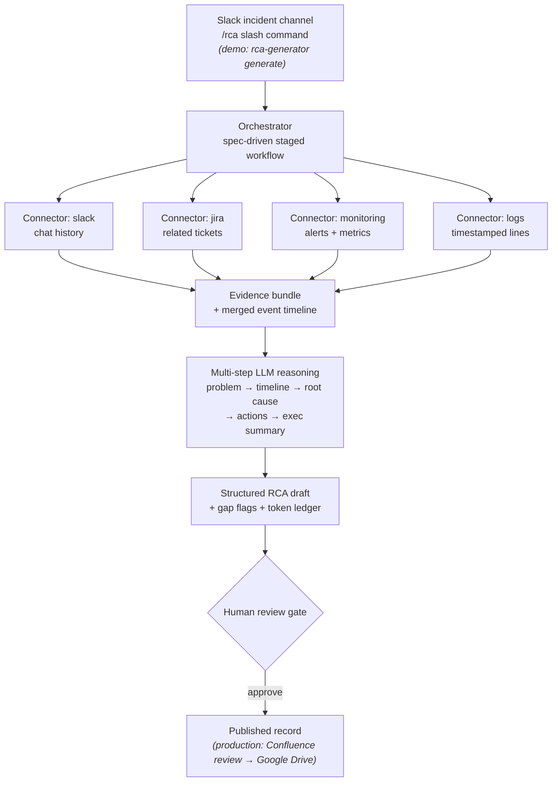

# rca-generator


An agentic RCA generator. After a P1 incident, writing the postmortem takes
engineers a day or two: scanning the Slack incident channel, chasing teams for
ticket references and monitoring data, and hand-assembling it all into the
standard format. This collapses that to minutes — a staged LLM pipeline pulls
the incident's existing artifacts through pluggable connectors, reasons over
them in five verifiable steps, and produces a fully structured RCA draft that
a human reviews before it becomes the record.

Built spec-first: [SPEC.md](SPEC.md) pins down the problem statement, goals,
workflow stages, and data requirements the pipeline implements. Behavior not
in the spec is out of scope for the agent — that's what keeps it predictable
rather than open-ended.

## Architecture



Production deploys this as a Slack bot: the slash command invokes the
workflow, each connector is an MCP server, the draft lands in Confluence for
review, and the approved document ships to Google Drive. This repo is the
same pipeline with file-backed stand-ins so everything runs offline:

| Production                     | This repo                                      |
|--------------------------------|------------------------------------------------|
| `/rca` slash command           | `rca-generator generate --incident-dir …`      |
| MCP servers (Slack/Jira/Grafana/logs) | File-backed connectors behind the same protocol (`connectors.py`) |
| Claude via Bedrock             | Anthropic API, or a deterministic offline template client |
| Confluence draft for review    | `drafts/`                                      |
| Google Drive published record  | `rca-generator publish` → `published/`         |

## Design decisions

- **Pluggable connectors (MCP in production)** — the orchestrator only sees
  the `Connector` protocol. Adding Grafana or Sumo Logic is a new registry
  entry, not a rewrite. Loose coupling is the point.
- **Multi-step reasoning, not single-shot** — five scoped stages
  (`stages.py`), each a separate LLM call that receives the evidence plus
  prior sections. Smaller prompts hallucinate less, and each section is
  independently verifiable in review — when one section is wrong, you debug
  one stage, not one mega-prompt.
- **Gap detection over fabrication** — a stage whose required evidence is
  missing gets a structural `[GAP: …]` flag (pipeline-enforced, not
  prompt-hoped), and the prompts additionally instruct the model to flag thin
  evidence instead of inventing. Engineers see exactly what to chase.
- **Human review gate** — `generate` only ever writes a DRAFT.
  `publish --approved-by <name>` promotes it, and refuses while unresolved
  `[GAP:]` flags remain unless explicitly acknowledged. Bad RCAs stay out of
  the record.
- **Token ledger** — every stage's input/output tokens are recorded per run
  and reported in the draft's appendix. Cost awareness from day one.

## Usage

```bash
pip install -e .

# 1. Draft (offline template mode; set ANTHROPIC_API_KEY for a real narrative)
rca-generator generate --incident-dir examples/incident-001

# 2. Review drafts/incident-001-rca.md, resolve gaps, then publish
rca-generator publish drafts/incident-001-rca.md --approved-by priya
```

`generate` prints a run summary:

```
Draft written to drafts/incident-001-rca.md
Evidence fetched: slack, jira, monitoring, logs
Gaps flagged: 0 | tokens: 3494 in / 177 out
```

Point it at a directory containing only the Slack thread and the same run
flags what's missing instead of guessing:

```
Evidence fetched: slack
Gaps flagged: 4 | tokens: 1969 in / 177 out
Review the Data Gaps section before publishing.
```

With `ANTHROPIC_API_KEY` set, stages run against the Anthropic API
(`--model`, default `claude-sonnet-5`); without it, a deterministic template
client exercises the identical pipeline offline — same stages, same gap
flags, same ledger — which is what CI runs.

## Input formats

An incident directory holds whatever artifacts exist (all optional — missing
ones become gap flags): `slack_thread.json`, `tickets.yaml`, `alerts.yaml`,
`metrics_summary.yaml`, `logs.txt`. See `examples/incident-001/` for the
shapes.

## Limitations

Root-cause accuracy is bounded by evidence completeness: Slack and tickets
capture what people *said*, not what the system *did*. When monitoring and
log data are absent the pipeline says so instead of guessing — but a flagged
gap is still a gap. The roadmap is more telemetry connectors (full Grafana
metric history, Sumo Logic queries, deployment history) so the reasoning
moves from summarizing the conversation to diagnosing the system.

## Development

```bash
python3 -m venv .venv && source .venv/bin/activate
pip install -e ".[dev]"
pytest
ruff check .
```

## License

MIT
